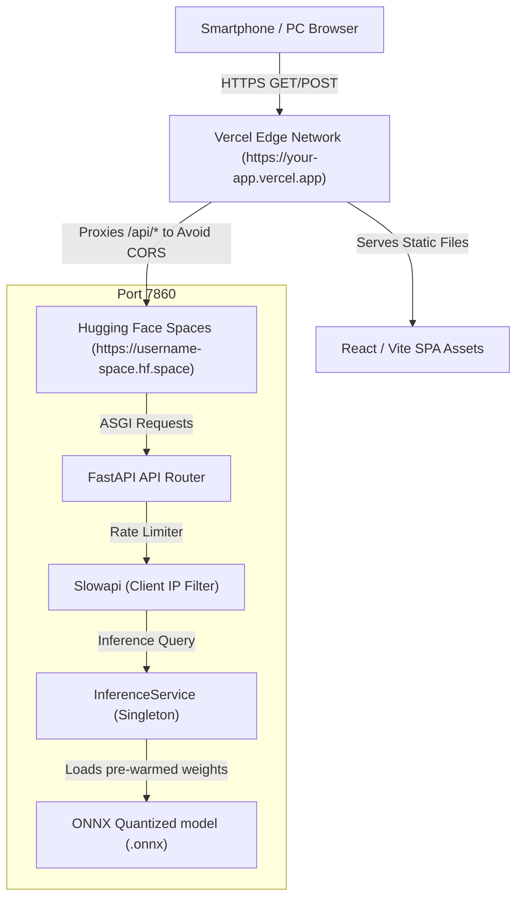

# Production Deployment Walkthrough: Crack Detection System

This walkthrough provides the complete DevOps/MLOps guide to deploy the React + Vite frontend on **Vercel** and the FastAPI backend on **Hugging Face Spaces** (using a Docker Space).

---

## 1. Recommended Architecture Diagram

The diagram below illustrates the serverless and edge-optimized request flow of the system:



---

## 2. Updated Project Folder Structure

Below is the verified structure of the project files created/updated for deployment:

```text
FASTCNN/
├── .github/
│   └── workflows/
│       └── deploy.yml               # CI/CD Automated Testing & Push Pipeline
├── backend/
│   ├── config.py                    # Settings & directory creation definitions
│   ├── main.py                     # API router with Rate-Limiting, MIME and 5MB validation
│   ├── schemas.py                   # Pydantic schemas (model-info endpoint support)
│   └── services.py                  # Active model loader & startup pre-warming
├── checkpoints/
│   ├── custom_cnn_quantized.onnx    # Edge-optimized Quantized model (Active)
│   └── custom_cnn_best.pth          # PyTorch backup weights
├── docker/                          # Original dev Docker files (Docker.backend / Docker.frontend)
├── frontend/
│   ├── src/components/
│   │   ├── BatchUpload.jsx          # Batch component using /api path
│   │   ├── DragDropUpload.jsx       # Single upload component using /api path
│   │   └── LiveCamera.jsx           # Camera component with smoothing & zoom using /api path
│   ├── .env.production              # VITE_API_URL=/api env file
│   ├── vercel.json                  # Vercel proxy rewrite config
│   └── vite.config.js               # Vite config with dev proxy & SSL settings
├── tests/
│   └── test_api.py                  # Pytest API integration validation suite
├── Dockerfile                      # Production multi-stage CPU-optimized Dockerfile
├── docker-compose.prod.yml         # Local Docker compose verify script
└── requirements.txt                # Locked dependencies (including slowapi)
```

---

## 3. Hosting & Infrastructure Comparison

| Dimension | Frontend (Vercel) | Backend (Hugging Face Spaces) | Backend (Render Free) |
| :--- | :--- | :--- | :--- |
| **Role** | Serves static assets, routes proxy | Runs FastAPI, loads models | Runs FastAPI, loads models |
| **Cost** | Free (Hobby) | **Free** | Free |
| **Resources** | Unlimited Edge Network | **16 GB RAM / 2 vCPUs** (High headroom) | 512 MB RAM / 0.1 vCPUs (Tight) |
| **Cold Starts** | None (Instant CDN) | **None** (Sleeps only after 48h idle) | Yes (Sleeps after 15m idle; 60s boot) |
| **SSL / HTTPS** | Automatic, free | **Automatic, free** | Automatic, free |
| **GPU** | N/A | Available (Paid Upgrade) | N/A |

---

## 4. Step-by-Step Deployment Guide

### Step 4.1: Local Docker Verification
First, verify that your production Docker container builds and starts correctly on your local machine:
```bash
# 1. Build and run the production image locally
docker compose -f docker-compose.prod.yml up --build

# 2. In another terminal, test that it is running and healthy
curl http://localhost:7860/health
curl http://localhost:7860/model-info
```

### Step 4.2: Push the Code to GitHub
1. Create a repository on GitHub (e.g., `fast-cnn-crack-detector`).
2. Add your remote and push your code:
```bash
git init
git add .
git commit -m "chore: setup production configs and MLOps pipeline"
git branch -M main
git remote add origin https://github.com/your-username/fast-cnn-crack-detector.git
git push -u origin main
```

### Step 4.3: Deploy Backend to Hugging Face Spaces
1. Sign in to [Hugging Face](https://huggingface.co/).
2. Click **New Space** in the top right.
3. Name your space (e.g., `crack-detection-api`).
4. Select **Docker** as the SDK.
5. Choose **Blank** template (the space will build using the `Dockerfile` at the root of your repository).
6. Select the **Public** option.
7. Click **Create Space**.
8. Go to your Hugging Face Profile -> **Settings** -> **Access Tokens** -> Click **New Token** and create a **Write** token. Copy this token.

### Step 4.4: Setup GitHub Actions CI/CD Secrets
In your GitHub repository, go to **Settings** -> **Secrets and variables** -> **Actions** -> click **New repository secret**:
*   `HF_TOKEN`: Paste the Hugging Face Write Token.
*   `HF_SPACE_PATH`: Enter your Space path (e.g., `your-username/crack-detection-api`).

Once pushed, GitHub Actions will trigger, run the linter and pytest tests, and push the repository to Hugging Face, which will build and start your API automatically.

### Step 4.5: Deploy Frontend to Vercel
1. Sign in to [Vercel](https://vercel.com/).
2. Click **Add New** -> **Project**.
3. Import your GitHub repository.
4. In the **Configure Project** screen:
   *   **Root Directory**: Click *Edit* and select **`frontend`**.
   *   **Build & Development Settings**: Leave as default (Vercel automatically detects Vite).
   *   **Environment Variables**: Add:
       *   `VITE_API_URL` = `/api`
5. Click **Deploy**.
6. Once deployed, copy your Vercel public URL (e.g., `https://fastcnn-frontend.vercel.app`).

### Step 4.6: Update Vercel Rewrite Endpoint
Now that your Hugging Face Space is building:
1. Find your Space API URL. Go to your Hugging Face Space, click the triple dots in the top-right -> **Embed the Space** -> Copy the **Direct URL** (e.g., `https://username-space.hf.space`).
2. Open your local **`frontend/vercel.json`** file and update the `destination` URL to point to your Space API:
   ```json
   {
     "source": "/api/:path*",
     "destination": "https://username-space.hf.space/:path*"
   }
   ```
3. Commit and push the change to GitHub:
   ```bash
   git add frontend/vercel.json
   git commit -m "deploy: update vercel proxy to point to hf spaces"
   git push origin main
   ```
Vercel will detect the push, rebuild your frontend in seconds, and all calls to `/api` will now be safely routed to your Hugging Face Space!

---

## 5. Cost & Free-Tier Limitations
*   **Hugging Face Spaces**: $0 (100% Free). The space runs indefinitely. If it remains unused for 48 hours, it will enter "sleeping" mode. The next visit to the Space page (or hitting the API) will automatically spin it back up in ~30 seconds.
*   **Vercel**: $0 (100% Free Hobby Tier). Includes automatic SSL, worldwide CDN routing, and serverless rewrites.
*   **Custom Domain**: ~$10/year (if you choose to buy one). Connection and SSL certificates are free on Vercel.

---

## 6. Buying and Connecting a Custom Domain

When you are ready to use a custom domain (e.g., `mycrackdetector.com`):

1.  **Buy a Domain**: Purchase a domain from GoDaddy, Namecheap, or Hover.
2.  **Add to Vercel**:
    *   Go to Vercel -> Your Project -> **Settings** -> **Domains**.
    *   Add `app.mycrackdetector.com` (for your React app).
3.  **Configure DNS (on GoDaddy/Namecheap)**:
    *   Create a **CNAME** record:
        *   Host: `app`
        *   Value: `cname.vercel-dns.com.`
4.  **SSL Setup**: Vercel handles this automatically! As soon as the CNAME record propagates, Vercel will request and configure a Let's Encrypt SSL certificate for free.
5.  **Backend Custom Domain**: Hugging Face Spaces run under `*.hf.space` out-of-the-box. There is no need to assign a custom domain to the backend, as Vercel rewrites handles the mapping. All requests go through `https://app.mycrackdetector.com/api` and route to Hugging Face behind the scenes!

---

## 7. Final Production Checklist

- [x] **Rate Limiting**: `slowapi` checks IP limits to block automated scripts/crawlers.
- [x] **Security Constraints**: Uploads strictly limited to image types and sizes <= 5MB.
- [x] **Aspect Ratio Crop**: Frontend cropped squares match `224x224` training dimensions to avoid squishing.
- [x] **Temporal Smoothing**: Video scanning averages predictions to reduce noise/flicker.
- [x] **Model Optimizations**: ONNX Quantization is active for maximum CPU speed and minimal RAM overhead.
- [x] **Model Pre-warming**: Model does a dry-run inference on startup so the first request is instant.
- [x] **No CORS / Mixed Content Problems**: Controlled via Vercel proxy rewrites.
